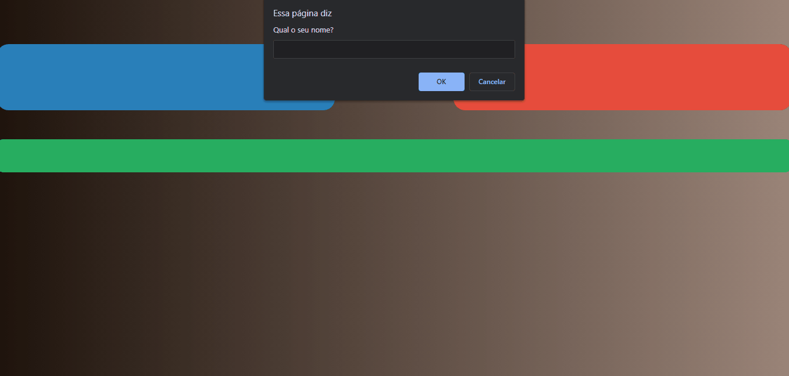

<h1 align="center">
    Jokenpô
</h1>

 

## :camera: Demonstração

 <h1>Demo:</h1>
  

## :rocket: Tecnologias

Esse projeto foi desenvolvido com as seguintes tecnologias:

✔️HTML

✔️CSS

✔️JavaScript

## 💻 Projeto

Um jogo simples que simula o tradicional jokenpô.

---

Made with 💜 by João Artur 👋 See my <a href="https://www.linkedin.com/in/magalhesartur/">Linkedin</a>

